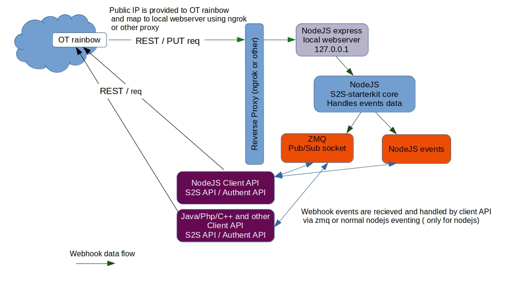
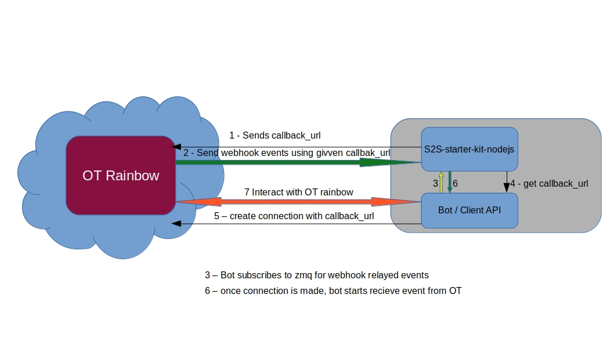

# Building S2S based application with Rainbow OpenAPI Specifications file and S2S Starter Kit

## What is OAS ( Open API Specification)

This definition form [opeanpis.org](http://spec.openapis.org/oas/v3.0.2) gives a clear sumary of OAS

The OpenAPI Specification (OAS) defines a **standard**, **language-agnostic interface to RESTful** APIs which allows both humans and computers to discover and understand the capabilities of the service without access to source code, documentation, or through network traffic inspection. When properly defined, a consumer can understand and interact with the remote service with a minimal amount of implementation logic.

An OpenAPI definition can then be used by **documentation generation tools** to display the API, **code generation tools** to generate servers and clients in various programming languages, testing tools, and many other use cases.
OAS is standard, language-agnostic interface to RESTfull APIs.

An OAS file is call swagger and can be in json format or yaml

We are not going to describe OAS specification in detail, it's not the purpuse of this document

## Rainbow OpenAPI Specifications files (swagger files)

Rainbow server exposes various RESTfull enpoints to help users intergrate communication features in their own appliactions

Those RESTfull API endpoints are described in OAS swagger definition files

| OAS specifications       | description       |
|------------------|----------------------|
|  [Rainbow Authent Portal](https://hub.openrainbow.com/api/authentication/) |         Authentication API      |
| [S2S Portal]()|           Server to server API hidding XMPP protocoles, for the moment it is essentially used for Instante messaging communication         |
Each swagger file can be used to generate client APIs that hide all REST protocol and data consistency check.

## S2S NodeJS Starter Kit composition



S2S NodeJS StarterKit is a NodeJS component that implements client APIs in NodeJS to interact with OT Rainbow and a local REST server (to handle webhook events via callback url ) .
OT Rainbow act has a client for the REST server (by POSTING event data to the callbak url)

### Configuration files

| config file |  description |
|--------------|-----------------|
| rainbow-s2s-starterkit-nodejs/config/StarterKitConfig.json.sample | starter kit main configuration file (to rename .json and update according to your rainbow registration params). it defines bot credentials, localhost server settings |

Rainbow-S2S-Starterkit-NodeJS  configuration file is used to confiure 6 main entities

| config file entity |  description |
|-----------------------|-----------------|
| rainbow | Configures the Rainbow server host we are connecting to and tell rainbow who we are - |
| credentials | contains registerd account credentials |
| application | contains the application registration keys appID and appSecret |
| logs | contains logs enablement config |
| im | enables or disables automatic IM read acknowlegdement |
| rainbow_notification_service | configure each component (Rainbow-S2S-Starterkit-NodeJS internal proxy named ngrok or your own reverse proxy and zmq ) involved in webhook event notification |


S2S NodeJS Starterkit has 

### Client API (Authentication and S2S portal API )

Composed by 6 main modules ( 1 from AuthPortal and 5 from S2S Portal)

- Authentication (Authent Portal)
- Connection (S2S Portal)
- Conversation (S2S Portal)
- Message (S2S Portal)
- Presence (S2S Portal)
- Room (S2S Portal)

#### Authentication

Method | HTTP request | Description
------------- | ------------- | -------------
[**getApiRainbowAuthenticationV10Validator**](AuthenticationApi.md#getApiRainbowAuthenticationV10Validator) | **GET** /api/rainbow/authentication/v1.0/validator | Validate user JWT
[**getBasicLogin**](AuthenticationApi.md#getBasicLogin) | **GET** /api/rainbow/authentication/v1.0/login | Login user
[**getLogout**](AuthenticationApi.md#getLogout) | **GET** /api/rainbow/authentication/v1.0/logout | Logout user
[**getRenew**](AuthenticationApi.md#getRenew) | **GET** /api/rainbow/authentication/v1.0/renew | Renew user JWT

#### Connection

Method | HTTP request | Description
------------- | ------------- | -------------
[**connectionCreate**](ConnectionApi.md#connectionCreate) | **POST** /api/rainbow/ucs/v1.0/connections | Create a new user connection
[**connectionDelete**](ConnectionApi.md#connectionDelete) | **DELETE** /api/rainbow/ucs/v1.0/connections/{id} | Delete a connection
[**connectionIndex**](ConnectionApi.md#connectionIndex) | **GET** /api/rainbow/ucs/v1.0/connections | List all user connections
[**connectionShow**](ConnectionApi.md#connectionShow) | **GET** /api/rainbow/ucs/v1.0/connections/{id} | Get the data of a connection

#### Conversation

Method | HTTP request | Description
------------- | ------------- | -------------
[**conversationChatstate**](ConversationApi.md#conversationChatstate) | **PUT** /api/rainbow/ucs/v1.0/connections/{cnxId}/conversations/{cvId}/chatstate/{state} | Send a chat state
[**conversationCreate**](ConversationApi.md#conversationCreate) | **POST** /api/rainbow/ucs/v1.0/connections/{cnxId}/conversations | Create a conversation
[**conversationDelete**](ConversationApi.md#conversationDelete) | **DELETE** /api/rainbow/ucs/v1.0/connections/{cnxId}/conversations/{id} | Delete a conversation
[**conversationIndex**](ConversationApi.md#conversationIndex) | **GET** /api/rainbow/ucs/v1.0/connections/{cnxId}/conversations | Get all conversations
[**conversationShow**](ConversationApi.md#conversationShow) | **GET** /api/rainbow/ucs/v1.0/connections/{cnxId}/conversations/{id} | Get a conversation

#### Message

Method | HTTP request | Description
------------- | ------------- | -------------
[**messageCreate**](MessageApi.md#messageCreate) | **POST** /api/rainbow/ucs/v1.0/connections/{cnxId}/conversations/{cvId}/messages | Send a new message
[**messageDeleteAll**](MessageApi.md#messageDeleteAll) | **DELETE** /api/rainbow/ucs/v1.0/connections/{cnxId}/conversations/{cvId}/messages | Delete all conversation messages
[**messageIndex**](MessageApi.md#messageIndex) | **GET** /api/rainbow/ucs/v1.0/connections/{cnxId}/conversations/{cvId}/messages | List the messages of a conversation
[**messageReadReceipt**](MessageApi.md#messageReadReceipt) | **PUT** /api/rainbow/ucs/v1.0/connections/{cnxId}/conversations/{cvId}/messages/{id}/read | Send a read receipt
[**messageReceivedReceipt**](MessageApi.md#messageReceivedReceipt) | **PUT** /api/rainbow/ucs/v1.0/connections/{cnxId}/conversations/{cvId}/messages/{id}/received | Send a received receipt

#### Presence

Method | HTTP request | Description
------------- | ------------- | -------------
[**presenceShow**](PresenceApi.md#presenceShow) | **GET** /api/rainbow/ucs/v1.0/connections/{cnxId}/presences/{userId} | Probe a user&#39;s presence
[**presenceUpdate**](PresenceApi.md#presenceUpdate) | **PUT** /api/rainbow/ucs/v1.0/connections/{cnxId}/presences | Set the user&#39;s presence

#### Room

Method | HTTP request | Description
------------- | ------------- | -------------
[**roomJoin**](RoomApi.md#roomJoin) | **POST** /api/rainbow/ucs/v1.0/connections/{cnxId}/rooms/{roomId}/join | Join a room

### Webhook event handler (REST server)

As automatic callbacks handling is not yet supported by OpenAPI Generators, a REST server for callback notification events must be implemented

To do this, a new swagger file is created by extracting all callbacks specification (endpoints definition and schema) from S2S Portal.
The REST server implementation is automatically done in NodeJS using openapi-backend module.

This module validates all recieved data according to contract defined in swagger file and fires them in predefined events using nodejs Event core.

S2S predefined event list :

| S2S events | Description |
| ------------------------------------- | ----------------------------------- |
| **rainbow_onconnectioncreated** | Fired when the connection with rainbow is created bot not sign in |
| **rainbow_onconnectionerror** | Fired when the connection can't be done with Rainbow (ie. issue on sign-in) |
| **rainbow_onmessagereceived** | Fired when a one-to-one message is received |
| **rainbow_onmessageserverreceiptreceived** | Fired when the message has been received by the server |
| **rainbow_onmessagereceiptreceived** | Fired when the message has been received by the recipient |
| **rainbow_onmessagereceiptreadreceived** | Fired when the message has been read by the recipient |
| **rainbow_onallmessagereceiptreceived** | Fired when the all message has been received by the recipient |
| **rainbow_onallmessagereceiptsent** | Fired when the all message has been sent to the recipient |
| **rainbow_onpresencechanged** | fired when the presence of the connected user changes |
| **rainbow_onerror** |  Fired when something goes wrong (ie: bad 'configurations' parameter, impossible to connect or reconnect, etc...) |
| **rainbow_onbubbleremoved** | Fired when a bubble the connected user is member of is deleted |
| **rainbow_onbubbleinvitationreceived** | Fired when an invitation to join a bubble is received |
| **rainbow_onready** | Fired when S2S starterkit is connected to Rainbow and ready to be used |
| **rainbow_onstarted** | Fired when the S2S starterkit has successfully started (not yet signed in) |
| **rainbow_onconnected** | Fired when the connection is successfull with Rainbow (signin complete) |
| **rainbow_onstopped** | Fired when the connection has stooped |
| **rainbow_ondisconnected** | Fired when the S2S starterkit lost the connection with Rainbow |
| **rainbow_onreconnecting** | Fired when the SDK tries to reconnect |
| **rainbow_onfailed** | Fired when the SDK didn't succeed to reconnect and stop trying |
| **rainbow_onbubbleaffiliationchanged** | Fired when a user changes his affiliation with a bubble |
| **rainbow_onconversationremoved** | Fired when a conversation is deleted |
| **rainbow_onconversationcreated** | Fired when a conversation is created |
| **rainbow_onconversationupdate** | Fired when a conversation is updated |
| **rainbow_onchatstate** | Fired when a chat state change occurs in a conversation |
| **rainbow_onreceipt** | Fired when a receipt notification occurs |

#### Webhook event forwarding using zmq

As REST embeded server with data validation over openapi-backed module can be generated in NodeJS with small footprint it may be not necessary to implement a RESTfull server every time another programming laguage is used.

The NodeJS webhook event handler can be used if we are abble to forward events in an agnostic way ( via socket for example )

[Zmq](https://zeromq.org/) ( Zero Message Queue ) was choosed to do this.

Here is a description from zmq website

ZeroMQ (also known as ØMQ, 0MQ, or zmq) looks like an **embeddable networking library** but acts like a concurrency framework. It **gives you sockets that carry atomic messages across various transports** like **in-process, inter-process, TCP, and multicast**. You can **connect sockets N-to-N** with patterns like fan-out, **pub-sub**, task distribution, and request-reply. It's fast enough to be the fabric for clustered products. Its **asynchronous I/O model** gives you scalable multicore applications, built as asynchronous message-processing tasks. It has a **score of language APIs** and **runs on most operating systems**. 

##### S2S NodeJS Starterkit zmq implemented module ( ZmqEventPublisher.js)

Everytime an event is published by S2S Starter Kit, the same event is forward to zmq socket.

zmq si bind to a configurable port located in rainbow-s2s-starterkit-nodejs/config/StarterKitConfig.json.sample

In our sample, we use 3000

```
[section zmq of StarterKitConfig.json.sample]
{
    "host": "127.0.0;1"
    "port": 3000
}
```

The event forwarding implementation is done using ZmqEventPublisher.js and Event.js from S2S NodeJS Starter Kit.

```
[rainbow-s2s-starterkit-nodejs/modules/common/ZmqEventPublisher]
// require zmq nodejs API 
var zmq = require("zeromq");

class ZmqEventPublisher {

    constructor(logger, options) {
        // instantiate zmq bublication socket ( we will use pub/sub protocol)
        this._pubSock = zmq.socket("pub");
        this._logger = logger;
        this._options = options;
    }

    async start() {
        let that = this;
        that._logger.enter('starting zmq publisher connection on tcp://' + that._options.rainbow_notification_service.zmq.host +
         ':' +   that._options.rainbow_notification_service.zmq.port);
        try {
            this._pubSock.bindSync("tcp://" + that._options.rainbow_notification_service.zmq.host +
             ":" + that._options.rainbow_notification_service.zmq.port);
            that._logger.exit("tcp://" + that._options.rainbow_notification_service.zmq.host +
             ":" + that._options.rainbow_notification_service.zmq.port + ' started!');
        } catch (e) {
            that.error('failed to start zmq publisher connecton', e);
        }
        return true;
    }

    async stop() {
        let that = this;
        try {
            that.enter('closing zmq publisher connecton...');
            this._pubSock.close();
            that.exit('zmq publisher connecton closed !');
        } catch (e) {
            that.error('failed to close zmq publisher connecton', e);
        }
        return true;
    }

   /**
      This methode publishes webhook events to zmq socket
   	eventName : the event name ( rainbow_onxxxxxx )
   	eventData : the webhook event data conform to swagger specification
   */
    async publish(eventName, eventData) {
        let that = this;
        let data = JSON.stringify(eventData);
        that._logger.enter(`publishing ${eventName} with data :${data}`);
        this._pubSock.send([eventName, JSON.stringify(data)]);
        that._logger.exit(`${eventName} published`);
        return true;
    }
}
module.exports = ZmqEventPublisher;

S2S NodeJS Starterkit core eventing module
[rainbow-s2s-starterkit-nodejs/modules/common/Event.js]

class Event{
    
   ...
    
  publish(event, data) {
     let info = data || Error.OK;
     ...
        // publish event with node eventing using NodeJS proper eventing mechanism
        this.publishEvent(event, info);
        
        // publish event on zmq socket using ZmqEventPublisher modul
        this._zmqEventPublisher.publish(event, JSON.stringify(info));
  }
}
```
#### Subscribing to Rainbow OT events using zmq

Zmq has API in many programming languages :

Bash | C | C++ | C# | Common Lisp | D | Erlang | Go | Haskell | Java | Lua | node.js | Perl | PHP | Python | Python (Twisted) | Racket Ruby | Ruby (FFI) | Swift | TCL ...

Whatever the language used, the principe is to bind (using zmq subscription socket mode) to localhost and port defined in the Rainbow-S2S-Starterkit-NodeJS (zmq.json) and listen to Rainbow fired events.

```
[php way]
        // bind to port in subscription mode
        $port = <value from zmq.json configuration file>
        $loop = Factory::create();
        $context = new Context($loop);
        $subscriber = $context->getSocket(ZMQ::SOCKET_SUB);
        $subscriber->connect("tcp://127.0.0.1:${port}");
        $subscriber->setSockOpt(ZMQ::SOCKOPT_SUBSCRIBE, '');

        // waiting and processing from message
        subscriber->on('messages', function ($msg) {
                // event name ( rainbow_onxxxxxxx )
                $eventname = $msg[0];
                // json string containning the rainbow event data.
                $eventdata = $msg[1];
        }

[java way]

import zmq.Ctx;
import zmq.Msg;
import zmq.SocketBase;
import zmq.ZMQ;
...
        boolean canStop = false;
        port = <value from zmq.json configuration file>
        // bind to port in subscription mode
        Ctx ctx = ZMQ.init(1);
        SocketBase recv = ZMQ.socket(ctx, ZMQ.ZMQ_SUB);
        boolean rc = ZMQ.connect(recv, "tcp://127.0.0.1:"+port);
        Msg event;
        Msg eventContent;
        ZMQ.setSocketOption(recv, ZMQ.ZMQ_SUBSCRIBE, "");

...
        while (canStop) {
                long startMili = System.currentTimeMillis();//
                event = ZMQ.recv(recv, 0); // event name
                eventContent = ZMQ.recv(recv, 0); // event data
        }
```

For other languages, many samples can be found on zmq website and comunity.

## Step by Client API generation

### NodeJS language

#### Authen portal client API

1 - Download [OpenAPI generator Tool](https://openapi-generator.tech/docs/installation.html)

2 - Download authentication swagger from [Rainbow Authent Portal](https://hub.openrainbow.com/api/authentication/)

3 - Generate API by typing :

openapi-generator generate --additional-properties useES6=false -i swagger.json -g javascript -o authent_portal_client_api  -c config.json

```
[config.json content]
{
        "usePromises":true
}
```

#### S2S portal client API

1 - Same as Authen portal 

2 - Download authentication swagger from [Rainbow S2S Portal](https://hub.openrainbow.com/api/authentication/)

3 - Same as Authent portal

### PHP language

#### Authen portal client API

2- Download authentication swagger from [Rainbow Authent Portal](https://hub.openrainbow.com/api/authentication/)

3 - Generate API by typing :

openapi-generator generate -i swagger.json -g php -o authent_portal_client_api -c config.json

Client api will be generated in directory authent_portal_client_api

```
[config.json content for php]

{
        "apiPackage":"Api",
        "modelPackage":"Model",
        "invokerPackage":"Ale\\Rainbow\\S2S\\Client\\AuthPortal",
        "packageName":"GeneratedS2S"
}

classes will be generated with namespace :

namespace Ale\Rainbow\S2S\Client\AuthPortal\Api => for API
namespace Ale\Rainbow\S2S\Client\AuthPortal\Model => for models used in API

```
**IMPORNAT :**

For all generated client an API documentation is also automatically generated

This documentaion explains API usage for all actions defined in swagger.

See generated_api_output_directory/docs.

In our java samples we have :

[BotSample/s2s/docs/ConnectionApi.md](BotSample/s2s/docs/ConnectionApi.md)
[BotSample/s2s/docs/MessageApi.md](BotSample/s2s/docs/MessageApi.md)
[BotSample/s2s/docs/RoomApi.md](BotSample/s2s/docs/RoomApi.md)
[BotSample/s2s/docs/ConversationApi.md](BotSample/s2s/docs/ConversationApi.md)
[BotSample/s2s/docs/PresenceApi.md](BotSample/s2s/docs/PresenceApi.md)

[AuthenticationApi.md](BotSample/rainbow_authent_portal/docs/AuthenticationApi.md)


#### S2S portal client API

2 - Download authentication swagger from [Rainbow S2S Portal](https://hub.openrainbow.com/api/s2s/)

3 - Generate API by typing :

openapi-generator generate -i swagger.json -g php -o s2s_portal_client_api -c config.json

Client api will be generated in directory s2s_portal_client_api

```
[config.json content for php]

{
        "apiPackage":"Api",
        "modelPackage":"Model",
        "invokerPackage":"Ale\\Rainbow\\S2S\\Client\\S2S",
        "packageName":"GeneratedS2S"
}

classes will be generated with namespace :

namespace Ale\Rainbow\S2S\Client\S2S\Api => for API
namespace Ale\Rainbow\S2S\Client\S2S\Model => for models used in API

```

## Integrating Rainbow-S2S-Starterkit-nodejs with Bot developped using other languages than NodeJS


In previous sections we've explained :

- zmq role in Rainbow-S2S-Starterkit-nodejs webhook message forwarding via socket and how events are published using zmq NodeJS API

- We've explained how to subscribe to webhook relayed events using zmq API as subscriber in other languages ( java, php) to avoid REST server implementation.

 Many other language can be used  with zmq (see [zmq](https://zeromq.org/get-started/) website)

- We've explained how to generated client API using swagger specification to connect and interact with OT rainbow.

We will now focus on callback_url and explain the importance of sharing it between Client API ( in other languages ) and raibow-s2s-starterkit-nodejs.

### callback_url role





For ease of use, when starting raibow-s2s-starterkit-nodejs, the callback_url is written in OS temp dir ( on linux it is /tmp/s2s/s2s_callback_url.json ) but also returned by raibow-s2s-starterkit-nodejs (in start method Promise callback)

```
Sample
const myS2sStarterkit = new S2sStarterkit(sdkConfig);
(async() => {
    try {
       // writes callback_url in tmp dir under s2s/s2s_callback_url.json and also return it in start callback promise
        await myS2sStarterkit.start().then((data) => {
                // (data = callback_url )
                // so your bot startup script can be called here if the bot is implemented in another language
        }).catch((e) => {
            console.error(e);
            myS2sStarterkit.stop();
        });
    } catch (ex) {
        console.log(ex);
    }
})();
```

This is important when the reverse proxy **url is dynamic and changes at each start up**. This is the case when using **ngrok**.

So Bot can be implemented to get callbak_url by reading /tmp/s2s/s2s_callback_url.json when starting or be implemented to get callback_url by reading command line argument.


```
[/tmp/s2s/s2s_callback_url.json sample content]
{
    "callback_url": "https://fb57eedb.ngrok.io"
}
```

### Bot implementation guide line

You are ready to build your own bot in another languae that nodejs.
Don't hesitate to have a look at generated API docs and code source samples.

To test your first API call, you can install and setup rainbow-s2s-starterkit-nodejs webhook event manager in a directory :

>mkdir mys2s_webhook_handler
> cd mys2s_webhook_handler
>mys2s_webhook_handler$ npm init
>mys2s_webhook_handler$ npm install rainbow-s2s-starterkit-nodejs

Update config/config.json

Rename s2snode-core-starter.js.sample to s2snode-core-starter.js

>mys2s_webhook_handler$ mv s2snode-core-starter.js.sample s2snode-core-starter.js

Start the webhook event handler

>mys2s_webhook_handler$ node s2snode-core-starter.js

Test your API call and see if events are returned back by Rainbow

To connect to Rainbow using your API,your are required to use a callback_url in connection API.
You can use the callback_url written in /tmp/s2s/s2s_callback_url.json by rainbow-s2s-starterkit-nodejs (section [callback_url role](#callback_url-role))

### Start a bot written in another language than NodeJS

[Rainbow-S2S-StarterKit-NodeJS](https://github.com/Rainbow-CPaaS/Rainbow-S2S-StarterKit-NodeJS.git)

#### Bot that reads callback_url from /tmp/s2s/s2s_callback_url.json (for testing)

Everything said here has already been mentioned.

1 - Create an empty NodeJS project

2 - go to your project directory and install rainbwo-s2s-starterkit-nodejs as already mentioned above.

3 - Start the S2S starterkit core

4 - Start your Bot ( depending on choosen language ) 

#### Bot that reads callback_url from command line parameter (for testing)

If your bot reads callback_url from comand line argument (the preferd method), you can test it as follow.

1 - Create an empty NodeJS project (it can be a sub-directory of your Bot)

2 - go to your project directory and install rainbwo-s2s-starterkit-nodejs

3 - start rainbow-s2s-starterkit-nodejs.

The callabck url is printed on standard output when starting rainbow-s2s-starterkit-nodejs.

4 - start your Bot (depending on choosen language) by passing the callback url as parameter.

##### Start your Bot with raibow-s2s-starterkit-nodejs

So if you have build a bot that reads command line argument, it can be started by raibow-s2s-starterkit-nodejs.

raibow-s2s-starterkit-nodejs comme with a script ready to use

Let's expose the implementation principle

##### Rainbow-S2S-StarterKit-NodeJS ready to use startup script (s2s-zmq-bot-loader.js) impementation principle

The principle is to get callabck url from S2S NodeJS starterkit module and call the Bot (written in another language) by passing that callback_url as command argument.

As the s2s-zmq-bot-loader.js script, is generic for all languanges, the bot language interpreter and its start up arguments is configurable in a json file.

```
[bot-loader-params.json]
{
        "interpreter": "<the language interpreter path>",
        "program": "fullpath to the bot startup program",
        "isblocking": "true if your program is blocking or false",
        "args": [
        ]
}
```

The script and a sample configuration file is provided when installing rainbow-s2s-starterkit-nodejs.

##### How to use rainbow-s2s-starterkit-nodejs bot loader ready to use script

If your working directory is **my_working_dir**

supposing your have a php bot is in the directory my_working_dir/**mybot** and a starting script called **start.php**

- go to my_working_dir
 my_working_dir#

- Create an NodeJS empty project (mybotloader) and install rainbow-s2s-starterkit-nodejs

Update configuration files as already seen.

- Edit /my_working_dir/mybotloader/config/config.json to fit your credentials and parameters
- Edit /my_working_dir/mybotloader/config/bot-loader-params.json to fit your bot loading parameters

```
[/my_working_dir/mybotloader/config/bot-loader-params.json]
{
        "interpreter": "/usr/bin/php",
        "program": "/my_working_dir/mybot/start.php",
	"isblocking": "true"
        "args": [
        ]
}

interpreter is your bot language interpreter
program is your bot main loader
args is the arguments that your bot needs if required

```

- Rename s2s-zmq-bot-loader.js.sample to s2s-zmq-bot-loader.js

- Start your bot and rainbow-s2s-starterkit-nodejs webhook by typing node s2s-zmq-bot-loader.js

>/my_working_dir/mybotloader# node s2s-zmq-bot-loader.js

The callbak url will be passed to /my_working_dir/mybot/start.php as argument

s2s-zmq-bot-loader.js will start rainbow-s2s-starterkit-nodejs and the bot by calling /usr/bin/php /my_working_dir/mybot/start.php callback_url

WARNING:

If you have other parameters to pass to your bot, we advise tou to use options forms like -p1=xxx or --p1=xxx.
Of course your bot should be implemented to read those options.

The config/bot-loader-params.json will look like this :

```
[/my_working_dir/mybotloader/config/bot-loader-params.json]
{
        "interpreter": "/usr/bin/php",
        "program": "/my_working_dir/mybot/start.php",
        "isblocking": "true"
        "args": [
		"--p1=xxx",
		"--p2=xxxx",
		...
		"--pn=xxxx"
        ]
}
```

s2s-zmq-bot-loader.js will start rainbow-s2s-starterkit-nodejs and the bot by calling /usr/bin/php /my_working_dir/mybot/start.php callback_url --p1=xxx --p2=xxx ... -pn=xxx
